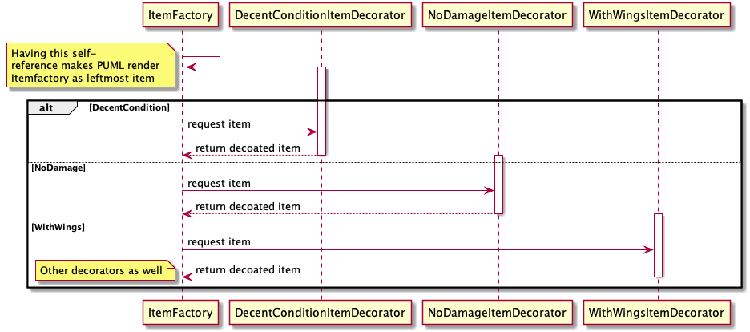

FØR LEVERING: 
- [ ] Fjern sjekkpunkter i hele documentation.md
- [ ] Legg pdf af dette dokumentet i rot 
- [ ] Sjekk at løsning kjører som en Visual Studion Solution 
- [ ] Legg ved en .exe-fil 
- [ ] Fjern sjekkpunkter i hele documentation.md

# Dokumentasjon 
- [Dokumentasjon](#dokumentasjon)
    - [Introduksjon](#introduksjon)
    - [Prosessen](#prosessen)
        - [Planlegging](#planlegging)
        - [Parprogrammering](#parprogrammering)
        - [Samarbeid](#samarbeid)
        - [prioriteringer](#prioriteringer)
    - [GRASP](#grasp)
    - [Diagrammer](#diagrammer)
        - [Klassediagram](#klassediagram)
        - [Sekvensdiagram](#sekvensdiagram)
        - [Bruksdiagram ("Use case")- [ ] Hva modelleres?](#bruksdiagram-%22use-case%22----hva-modelleres)
    - [Design patterns](#design-patterns)
        - [Factory](#factory)
        - [Decorator](#decorator)
        - [Singleton](#singleton)
        - [Composite](#composite)
        - [Facade](#facade)
        - [Flyweight](#flyweight)
        - [MVP](#mvp)
    - [Trådsikkerhet](#tr%C3%A5dsikkerhet)
    - [Enhetstesting](#enhetstesting)
    - [Om C# og vår kode](#om-c-og-v%C3%A5r-kode)
        - [Event dispatching](#event-dispatching)
        - [Operatoroverlasting](#operatoroverlasting)
        - [Regions](#regions)
        - [Properties](#properties)
        - [Kommentarer](#kommentarer)
        - [Konvensjoner](#konvensjoner)

## Introduksjon 
Vår oppgave har vært å simulere et loppemarked. 
Noen av menneskene på markedet er selgere og noen er kunder. Selgerene legger ut varer for salg. I det en vare legges ut for salg, forsøker samtlige kunder å kjøpe varen. Hver kunde har en reaksjonstid som varierer litt for hver gang. 
Flere selgere kan legge ut varer samtidig. 

Dersom en kunde forsøker å kjøpe en vare de ikke har råd til, vil de forsøke å prute. Dersom prutingen lykkes, får de varen til en pris de har råd til. 

Markedet vil (naturlig nok) tape aktivitet så fort kundene går tom for penger. 

## Prosessen 
### Planlegging 
Vi startet prosessen vår med å kladde notater på et digitalt notatark. Vi ønsket å fokusere på å få med design patterns og snakket fort om hvor hvilke patterns kunne høre hjemme. Vi repeterte også deler av pensum for å vite hva vi skulle tenke på når vi fortsatte. Vi bestemte oss også tidlig for å bruke samme IDE for at vi skulle ha like referanserammer dersom problemer skulle oppstå. I og med at to på gruppen bruker Mac, landet vi på [Jetbrains' Rider](https://www.jetbrains.com/rider/) ganske fort. Vår erfaring var at [Visual Studio for Mac](https://visualstudio.microsoft.com/vs/mac/) var dårligere i bruk enn Windows-motparten. Vi har allikevel brukt Visual Studio innimellom for å være sikker på at prosjektet oppførte seg likt begge steder. 

### Parprogrammering 
Vi har brukt parprogrammering flere ganger, på store deler av prosjektet. Vår gruppe besto av tre mennesker, og iblant har vi også jobbet tre på samme datamaskin. Dette gjelder blant annet multithreading-koden, decorator-patternet og factory-klassene. 

Å være sammen om kode gjorde at man hadde noen å støtte seg på når man kom bort i utfordringer. Det var også lærerikt med samtalene som oppsto. Problemer ble gjerne løst litt fortere fordi den (eller de) man jobbet med ofte så problemet fra en litt annen vinkel en det man gjorde selv.  

Negative konsekvenser av parprogrammeringen var at ting i blant kunne ta litt lengre tid. Fra tid til annen kunne teknikken også føre til at man sporet av noe lettere enn dersom man jobbet alene. Avsporingen er koselig, men ikke nødvendigvis veldig effektiv. 

Opplevelsen var hyggelig og lærerik til tross for disse potensielle ulempene. 

### Samarbeid 
Vi har jobbet på forskjelige steder. Blant annet hjemme hos gruppemedlemmer, på skolen og over nett, med chat-tjenester som [Discord](https://discordapp.com/). De gangene vi ikke var enige om hvor og hvordan vi skulle jobbe, kom vi fort til enighet, gjerne samme morgen. 

Vi har brukt Git og Github for deling av kode gjennom et privat repository som bare gruppemedlemmene hadde tilgang til. Alle på gruppen har brukt Git tidligere, både på skole og fritid/jobb, så det gikk stort sett knirkefritt. 
### prioriteringer  
I vårt prosjekt har vi fokusert på å få med patterns. Vi har (som oppgaven nevner) presset inn noen deler av pensum selv om det ikke har vært fullstendig naturlig. Allikevel har vi ikke ønsket å ta det helt ut. I dette dokumentet kommer jeg til å gå i dypere detalj på forskjellige områder, men kort oppsummert har vi fokusert på logisk fordeling av oppgaver og ønske om presis kode som er lett å vedlikeholde. Med dette har vi dekket flere [GRASP-prinsippper](#GRASP). 

Hva [patterns](#design-patterns) angår, vil vi særlig trekke frem vår bruk av Factory-patternet og Decorator-patternet som gode eksempler hvor vi oppnår _low coupling_, _high cohesion_ og _polymorphism_. 

Vi har også ønsket å få med [C#-spesefikke](#om-c-og-v%C3%A5r-kode) muligheter som vi har lært i emnet, særlig dersom de ikke er mulige i Java. 


## GRASP 
I vår oppgave har vi hatt særlig fokus på Low coupling, High Cohesion, Pure Fabrication og Polymorphism. Vi har hatt lyst til å følge GRASP-prinsipper fordi ideen er at de vil gi kode som er lett å jobbe med, vedlikeholde og endre over tid dersom man følger dem. 

Vi mener at creator-prinsippet følges godt. `Person`-klassen instansierer for eksempel bare objekter av de klassene som den bruker tett, eller har som et felt i seg selv, i tråd med prinsippet. 

Det samme gjelder _High Cohesion_. Klasser spiller en rolle, og gjør ikke noe mer enn det som skal til for å utføre den. Market har for eksempel bare metoder som man kan forvente at et marked har. Det er mulig å splitte opp mer enn vi har gjort, men vi frykter at det vil gå på bekostning av lesbarheten til programmet, innenfor vårt prosjekt sine rammer.

Polymorphism er som sagt enda et prinsipp vi har lagt mye arbeid i å følge. Det kommer spesielt tydelig frem i Item-decoratorene. Der ligger alle spesialiseringer i subklasser. Et mindre omfattende eksempel er at `Customer` (som kan kjøpe) og `Salesman` (som kan selge) arver fra `Person`.

_Pure fabrication_ er enda et prinsipp vi får svært godt frem i våre factory-klasser; disse representerer ikke et egen konsept i domenet vi løser problemer i, men de gir lavere kobling (`Salesman`slipper å forholde seg til allem mulige `Item`-variamter) og vi får høyere "cohesion", i og med at factory-klassene har en svært veldefinert oppgave som det eneste de utfører. 

I vår løsning mener vi også at vi har fornuftig bruk av _Protected variations_. 
Abstrakte klasser og interfaces legger føringer for henholdsvis `Person`og `Item`, i stil med prinsippet. 

_Information expert_ kommer som en følge av at klasser kobles der det er natulig at de skal kobles. Det er for eksemple logisk at det er en person som har en `Wallet`, og at en `Person` holder på en liste med eiendeler. 

Det gir også lav kobling, siden andre klasser nå kan nå `Person` sin `Wallet` _gjennom_ person, heller enn at de må ha egne `Wallet`-objekter. 

Controller-prinsippet har vi ikke sett på som like viktig som de øvrige prinsippene for vår oppgave. Controller handler om å håndtere hendelser ("events") i programmet. 

Controller-prinsippet kan gi god oversikt over hva som skjer og når det skal skje. I og med at vi ikke har noen reelle brukere, har vi ikke de samme usikkerhetsmomentene som man ellers kunne tenke seg. Behovet for å tenke veldig mye på Controller har dermed ikke blitt vurdert til å være like viktig.  


## Diagrammer 
### Klassediagram 
 
- [ ] Hva modelleres? 
- [ ] Hva gir diagrammet oss? 
- [ ] Forskjellige koblinger 
### Sekvensdiagram 


- [ ] Hva modelleres? 
- [ ] Hva gir diagrammet oss? 
- [ ] Forskjellige koblinger 
- [ ] Opt vs alt og hvorfor det som er valgt, er valgt 
- [ ] Nevn annen syntaks som synkron/asynkron
### Bruksdiagram ("Use case")- [ ] Hva modelleres? 

- [ ] Hva gir diagrammet oss? 
- [ ] Forskjellige koblinger 
    - [ ] generalisering kan også gjøres mellom use-cases


## Design patterns 
- [ ] Generelt om design patterns 
- [ ] Hvilke vi har hatt fokus på
### Factory 
- [ ] Hva gjør det? 
- [ ] Hvor bruker vi dem?
- [ ] Hva oppnår de der de brukes? (GRASP?)
### Decorator 
- [ ] Hva gjør det? 
- [ ] Hvor bruker vi dem?
- [ ] Hva oppnår de der de brukes? (GRASP?)
### Singleton 
- [ ] Hva gjør det? 
- [ ] Hvor bruker vi dem?
- [ ] Hva oppnår de der de brukes? (GRASP?)
### Composite 
- [ ] Hva gjør det? 
- [ ] Hvor bruker vi dem?
- [ ] Hva oppnår de der de brukes? (GRASP?)
### Facade 
- [ ] Hva gjør det? 
- [ ] Hvor bruker vi dem?
- [ ] Hva oppnår de der de brukes? (GRASP?)
### Flyweight
- [ ] Hva gjør det? 
- [ ] Hvor bruker vi dem?
- [ ] Hva oppnår de der de brukes? (GRASP?)
### MVP 
- [ ] Hva gjør det? 
- [ ] Hvor bruker vi dem?
- [ ] Hva oppnår de der de brukes? (GRASP?)

## Trådsikkerhet 
Vi kjører i flere tråder (multithreading) når kunder skal forsøke å kjøpe varer. Som oppgaven spesifiserer, skal de "kaste seg over samme vare". Her oppstår det fare for at "race conditions" kan oppstå fordi koden ikke er trådsikker. 
Race conditions vil si at det oppstår feil fordi to ting leses på mer eller mindre samme tidspunkt, og som derfor fører til feil. 
I vår kode er følgende bit et eksempel på dette: 
```csharp
if (_items.Count == 0 || !_items.Contains(item)) return;
    // annen kode...
    DoTransaction() // DoTransaction fjerner item fra _items 
```
En race condition oppstår dersom: 
* Tråd 1 kommer gjennom if-setningen fordi Count != 0
* Tråd 2 kommer også gjennom fordi Tråd 1 ikke har rukket å oppdatere enda
For å unngå dette har vi brukt C# sitt lock-statement rundt funksjonaliteten i metoden. 

Oppgaven nevner at Random ikke er trådsikker. Dersom man bruker samme random-objekt i flerer tråder, vil man risikere at den ikke fungerer. Etter å ha studert koden vår nøye, mener vi at dette ikke forekommer hos oss. Vi bruker Random-klassen i ```Customer.AttemptBuy```, men da oppretter vi en ny instanse av den i hver tråd, den samme instansen brukes ikke flere steder. 

Dersom problemet skulle oppstå, finnes det en rekke løsninger, blant annet de man kan lese om [her](https://stackoverflow.com/questions/3049467/is-c-sharp-random-number-generator-thread-safe) og [her](https://stackoverflow.com/questions/19270507/correct-way-to-use-random-in-multithread-application). 

Fordeler ved multithreading er at man kan utnytte flere kjerner i maskinen. En potensiell ulempe er bugs som følge av race coditions og deadlocks (to tråder venter på hverandre).   


## Enhetstesting 
Enhetstesting er tester som sjekker om små biter av programmet fungerer hver for seg. Kjører man disse testene hver for seg (f.eks. automatisert etter hver lagring) vil man fort kunne oppdage feil i programmet underveis i utviklingen.

Vi har brukt enhetstesting på Person-funksjonaliteten vår og Decorator-funksjonaliteten. Vi har blant annet en test som vil feile dersom koden vår ikke lenger er trådsikker.  

Test-driven development er en programvareutviklingmetode der man starter med å lage tester for funskjonalitet som skal lages.
Deretter implementeres koden som trengs for å få testen til å passere. Man refaktorerer så koden, kjører den inn i versjonskontrollsystemet, og gjentar. Da vi skrev våre tester brukte vi denne teknikken.  

## Om C# og vår kode
### Event dispatching 
### Operatoroverlasting 
Operatoroverlasning er en mulighet C# gir, som lar programmereren bestemme hva vanlige operatorer (+, -, /, *, <, >, osv.) betyr mellom forskjellige typer. Har man en vektor-klasse, kan man for eksempel bestemme hva to instanser addert (+) med hverandre skal være. Vi har ikke funnet et naturlig sted for dette i vår løsning. Vi har allikevel tatt det med i Wallet-klassen for å demonstrere muligheten. 
### Regions 
Regioner er en måte å dele opp koden. Regionene legger ikke på funksjonalitet, men kan gjøre det mer oversiktelig for programmereren å gå gjennom den. Vi har anvendt regioner flere steder, blant annet i Simulation-klassen og i ItemFactory. 
### Properties 
- [ ] Hva det er 
- [ ] Hvor vi har brukt det 
- [ ] Hvor vi ikke har brukt det - hvorfor? 
### Kommentarer
### Konvensjoner 
Vi har etterstrebet å følge navnkonvensjoner som gjelder i C#. Det være seg blant annet "_"-prefiks på private klassevariable, stor forbokstav på metodenavn o.l. Her har vi fått mye støttet fra IDE-et vi brukte. Der hvor den har foreslått endringer, har vi stort sett gjennomført dem. Disse endringene inkluderer ternary-operatorer, null-propagation og bruk av "var"-nøkkelordet. 


